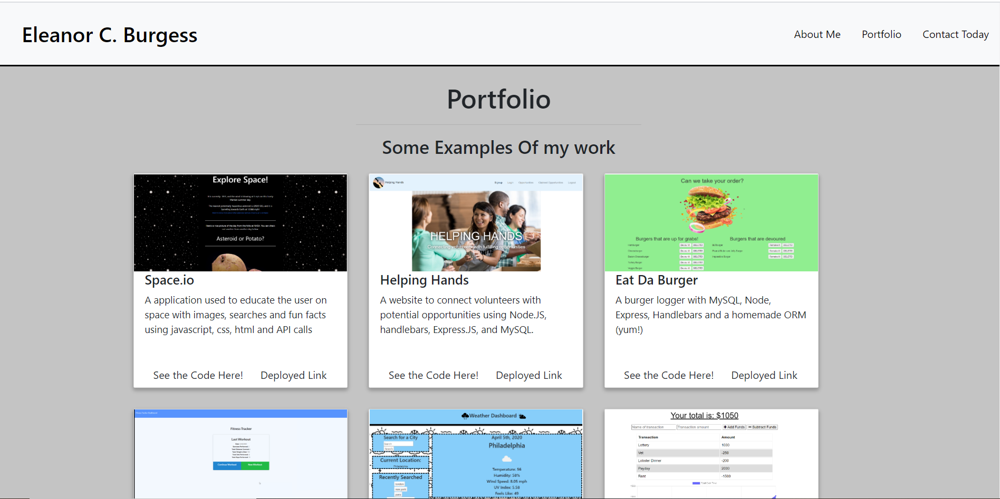

# react_portfolio_ECB

# Unit 18 PWA Homework: Offline Budget Tracker

This project was bootstrapped with [Create React App](https://github.com/facebook/create-react-app).This is my working portfolio and it will expand as I do more work.

## Table of Contents

1. [Link](#link)
2. [Description](#description)
3. [Use](#use)
4. [Installation](#installation)
5. [Contributing](#contributing)
6. [Questions](#questions)
7. [Example](#example)

### Link

The link to the heroku app for this repo is:

```
https://https://react-portfolio-ecb.herokuapp.com/
```

### Description

The application will be invoked with the following command:

```sh
npm  run start
```

The user will be told what port the app is being served on and can go to localhost: in the web browser.

### Use

AS AN new programmer
I WANT to be able to show off the work that i have done

### Installation

Please run npm install to handle dependencies.

### Contributing

Contributions to this project are welcome.

### Questions

If you have an questions about the repo, open an issue or contact Elly Burgess directly at Eleanor.C.Burgess@gmail.com.

### Pictures


